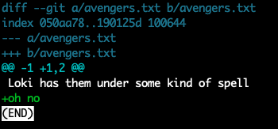

# Pre-work

---

The following pre-work should have been done before coming to Lab 1. Lab 1 consists of part 1 and part 2.

## Install Git

### Locally on Mac (and Linux)

You may already have Git on your machine. Follow these steps:

1. Open your terminal, type the command `git --version` and see if this gives you a response.  
2. If not, there is an official page for installing git at [https://git-scm.com/download/mac](https://git-scm.com/download/mac).  Go to the page and follow the instructions for Mac. 
3. Verify this was installed by running `git --version` from the terminal. 

### Locally on Windows

From previous classes, you probably already have [WSL](https://learn.microsoft.com/en-us/windows/wsl/install) installed. If that is the case, then:

1. Open WSL 
2. If not, there is an official page for installing git at [https://git-scm.com/download/win](https://git-scm.com/download/win). Go to this page and follow the instructions. You might also want to check out [gitforwindows.org](https://gitforwindows.org/)
3. Same as with the Mac installation, verify that git was installed by running `git --version` from the terminal. 

### Configuring Git

1. There are a number of online resources for Git. Look at Week 1 Modules on Canvas for these resources.

2. Set up your git installation with your author information. That way, when you make a commit, you are "signing" it so other developers know who made the commit.

        git config --global user.name "Your Name"
        git config --global user.email "your@email.address"

**Note**: The quotations are important.
    
   

## Setup GitHub Account

1. If you don't have a GitHub account, go to this link and follow the instructions to sign-up for a [GitHub account](https://docs.github.com/en/get-started/signing-up-for-github/signing-up-for-a-new-github-account), by [joining](https://github.com/join) GitHub.
2. As students, you have several benefits in GitHub, therefore I recommend you use your CMU email to sign-up for GitHub account, and get [the student benefits](https://education.github.com/benefits?type=student)
3. You can spend some time [cutomizing](https://docs.github.com/en/account-and-profile/setting-up-and-managing-your-github-profile/customizing-your-profile) your account.

## Setup SSH Keys

Before starting please read about SSH Keys [here](https://docs.github.com/en/authentication/connecting-to-github-with-ssh/about-ssh), and then do the following:

1. Check if you have any [existing SSH key](https://docs.github.com/en/authentication/connecting-to-github-with-ssh/checking-for-existing-ssh-keys?platform=mac). If you already had a GitHub account, chances are you also had an SSH Key. Make sure to use the tab with instructions corresponding to your OS (Mac, Linux, Windows).
2. If you do not have any prior SSH keys, please follow [these instructions](https://docs.github.com/en/authentication/connecting-to-github-with-ssh/generating-a-new-ssh-key-and-adding-it-to-the-ssh-agent) to generate a new SSH Key. Read them carefully and do them in order.
3. Add your new SSH key to your [GitHub account](https://docs.github.com/en/authentication/connecting-to-github-with-ssh/adding-a-new-ssh-key-to-your-github-account)
4. Test your [SSH connection](https://docs.github.com/en/authentication/connecting-to-github-with-ssh/testing-your-ssh-connection?platform=windows).

*NOTE: In all the links above (in this subsection), there is a tab to indicate your operating system at the top of the page. Make sure you're in the correct one.*

**CONGRATS! Now you are all set up and ready to start Lab 1 of 90-803!**

---

# Lab 1 - Part 1

###Objectives

- Get student's laptops ready to work through this course
- Install and configure Git on your laptop
- Learn basic Git functions through exercises

--

#### Getting Started with Git

To get a feel for how Git works without getting bogged down by code, we are going to set up some simple text files with material from various Marvel movies.  

1. Navigate to your home directory using cd, which stands for "Change Directory". It used to change the current working directory in Linux and other Unix-like operating systems. It is one of the most basic and frequently used commands when working on the terminal. From wherever you are, you can always go to your home directory with:

        cd ~

2. Make sure you are in your home directory using pwd. pwd command stands for Print Working Directory. It prints the full pathname of the current working directory to the standard output.

        pwd
        
3. Start by creating a folder or directory somewhere called 'marvel_movies' using the mkdir command:

        mkdir marvel_movies
        
4. Switch into that directory with `cd` (change directory)

        cd marvel_movies

5. Now, in that directory, we will create a new git repository by typing:

        git init

6. To save files to a Git repo (shorthand for repository), we need to understand that Git works in a two-step process. First, we send files from our working directory to a staging level. Once we have a collection of related files in staging we want to save to the repo, we `commit` those files along with a useful message explaining what was committed. Later if we ever want a file or set of files back from the repository, we can do so using the `checkout` process. The diagram below summarizes this:

  
  

7. Within your working directory, create an empty file called `avengers.txt`:

        touch avengers.txt

8. Now check that the file is untracked and needs to be sent to staging:

        git status

9. Add the file to the staging area:

        git add avengers.txt

 
  **Tip** - You can hit <TAB> (the tab key) to autocomplete filenames and directories.

10. Type `git status` again and verify that the file is ready to commit.

  Here's a screenshot that may be helpful:

11. Following the same previous steps, add another file called `doctor_strange.txt` to the working directory. Don't forget to add this new file in the staging to the repository.

12. Commit the files in staging to the repository:

        git commit –m "chore: avengers and doctor_strange files added to project"

  **Tip** - good messages are useful; always include a description message using the –m flag!

13. Confirm the change by running `git status`. Double-check the change by running `git log` to see the list of commits:

14.To make sure you have this git stuff down, do the following:

14.a. Add one quote from any of the movies to each file:

   - [The Avengers](https://www.imdb.com/title/tt0848228/quotes/qt1674075)
   - [Avengers: Age of Ultron](https://www.imdb.com/title/tt2395427/quotes/qt2466918)
   - [Thor: Ragnorok](https://www.imdb.com/title/tt3501632/quotes/qt3671520)
   - [Avengers: Endgame](https://www.imdb.com/title/tt4154796/quotes/qt4444043)
   - [Iron Man](https://www.imdb.com/title/tt0371746/quotes/qt0478075)
   - [Black Panther](https://www.imdb.com/title/tt1825683/characters/nm1569276)
   - [Doctor Strange](https://www.imdb.com/title/tt1211837/quotes/?ref_=tt_trv_qu)

We can add these quotes using the echo command, which prints something to the terminal and then sending this output to the file with >>.  For example:

echo "Loki has them under some kind of spell" >> avengers.txt

Now we can verify that this was written using the cat (short for concatenate) to display the file contents:

  cat avengers.txt

Now do this again for doctor_strange.txt

  14.b. Repeat the necessary git commands so that these changes are added and committed to the repository.

  14.c. Add a new file to the repository, this file can be of any of the movies provided in the links above. Refer back to the previous instructions if necessary.

- - -
#  Stop
Show a TA that you have completed the Lab up to this point. This is checkpoint 1.

- - -

#### Diffing and Removing Files
Now that we have a basic Git repository set up and know how to add files, we need also to learn how to remove files and how to compare versions of the same file at different levels. Let's start with removal. In the git status help, we saw the note that if we want to remove a file from the staging level.

1. Remove the `avengers.txt` by typing the following:

        git rm avengers.txt

  and verify that it's gone from your working directory.

2. **Oh snap!** We didn't want to delete the file! I meant to use `git rm --cached`. Don't worry, it hasn't been removed from the repository yet - we've just *marked* the file for deletion.

3. Get the file back by using `checkout`:

        git checkout HEAD avengers.txt

  **Note** - `HEAD` is a pointer to your most recent commit. This could also be the SHA value of any previous commit.

4. Add another famous quote to `avengers.txt`.

5. Use git diff to see what has changed:

        git diff

  

6. Stage and commit these changes:

        git add avengers.txt
        git commit -m "chore: added another quote to avengers.txt"

7. Add another quote to `doctor_strange.txt` and stage the file (`git add doctor_strange.txt`), but **do not commit**.

8. Run git diff:

        git diff

  You should not see any output. This is because the changes are staged and ready to be committed. If you want to see the difference between the staged version and the repository version, specify the `--cached` flag:

      git diff --cached doctor_strange.txt

9. Reverse your changes to `doctor_strange.txt`:

        git rm --cached doctor_strange.txt

10. We have decided that the file you added in `14.c` was unnecessary. Using git, remove the file. (On your own - see a TA if you need assistance)

#### Branching and Merging

We need to add new material from the other marvel movies to our project, and to do this, we will branch the project (if we don't like the changes, it will be very easy to just kill the branch and go back to master and try again – a great way to safely experiment within the project).

1. List all our current branches with:

        git branch

  The current (and only) branch is marked with a `*`.

2. Create a new branch called "black_panther":

        git branch black_panther

3. Run `git branch` again to verify the branch exists.

4. Switch to the `black_panther` branch:

        git checkout black_panther

5. Add a new file called `black_panther.txt`. Add a quote from the movie to this file.

  Add and commit this file to the repository with an appropriate message.

6. Return to the `main` branch (Note: it could be possible that the default branch in your repo is `master` instead of `main`. I suggest you change it to `main`. The default branch for GitHub repos is `main`):

        git checkout main

  You'll notice that the `black_panther.txt` file disappeared! Not to worry - it will be back soon enough.

7. Create and switch to a new branch called `thor`:

        git checkout -b thor

  **Tip** - in command, we created the branch and switched to it in one command by specifying the `-b` flag to `git checkout`.

8. On this new branch, add two new files:

        touch ragnorok.txt love_and_thunder.txt

  **Tip** - touch is a *Unix command for creating files

9. Commit these two files using what you learned earlier in the lab.

10. Checkout the master branch again (see previous commands for help).

11. Merge the `thor` branch back into the `main` branch:

        git merge thor

  **Note** - the branch `thor` still exists. If it's no longer needed, delete the branch with:

        git branch -d thor

12. Checkout the `black_panther` branch.

  Notice that the new movie files are gone, but the `black_panther.txt` is back in the working directory.

13. Add a new quote to `black_panther.txt` (anything will do) and commit the change to the repository.

14. Merge the `black_panther` branch back into the `main` branch (see #10..#11 for help).

  

There is obviously much more to Git, but this lab should get you familiar with the basics and started using Git and your proficiency should increase as you use it more in this course. Once the TA verifies the repo is set up, you are finished.

- - -
#  Stop
Show a TA that you have completed the first part. 

- - -

## Part 2

For this part, we will now use a remote repo.

1. Go to the link provided on Canvas to get your own copy of the repo we've created for this lab. This will put a copy of the starter code in a private repository for you.

2. You must not share this repository or its contents with any other student; this is for you and the teaching staff alone.  If someone offers you access to their private repository, please report that to us immediately.  As discussed on the first day of class, we are very strict on this point. 

3. Once you have the code in a private remote repository, you can clone it to your local laptop with the command  `git clone ...`, where the ... is the address given when you press the green Code button in GitHub. 
See the screenshot below for details. 

4. As you can see in this case, I prefer using the SSH option with the public key I have already set up with GitHub. Do NOT use the `Download ZIP` option -- far better to clone the repository, and it will establish the connection between local and remote repos for you.

5. After cloning to your local machine, you can work on the code and save it to your local repository.  When finished with a chunk of code and have saved it to your local repository, you can save these changes to your remote repository with the command 

	`git push origin <branch_name>` 

A word to the wise: saving regularly to your remote repository is a good way to protect yourself if something happens to your laptop.  We've had students in the past have laptop issues but saved regularly to the remote repository and were able to recover their code with minimal loss. 

Note also that you can save any/all of your branches to your remote repository, but come grading time, we are only grading what is on the master branch, so be sure to merge your final changes to that branch.

Additional resources:

* [Git Basics - Working with Remotes](https://git-scm.com/book/en/v2/Git-Basics-Working-with-Remotes)
* [Pushing Commits to a remote repo](https://docs.github.com/en/get-started/using-git/pushing-commits-to-a-remote-repository)

- - -
#  Stop
Show a TA that you have completed Part 2

- - -